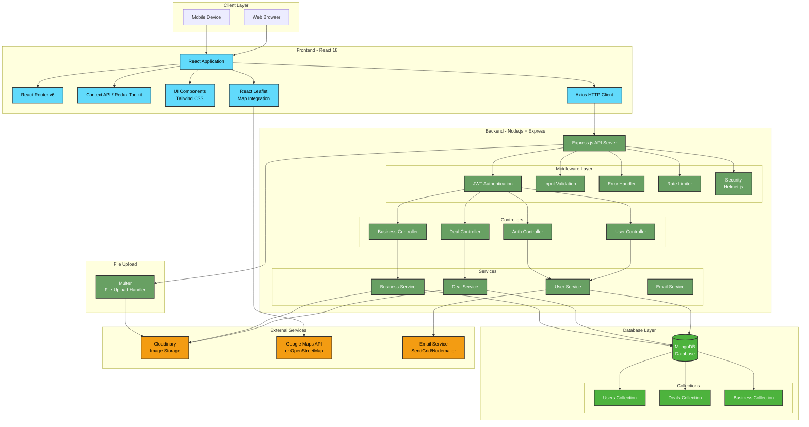
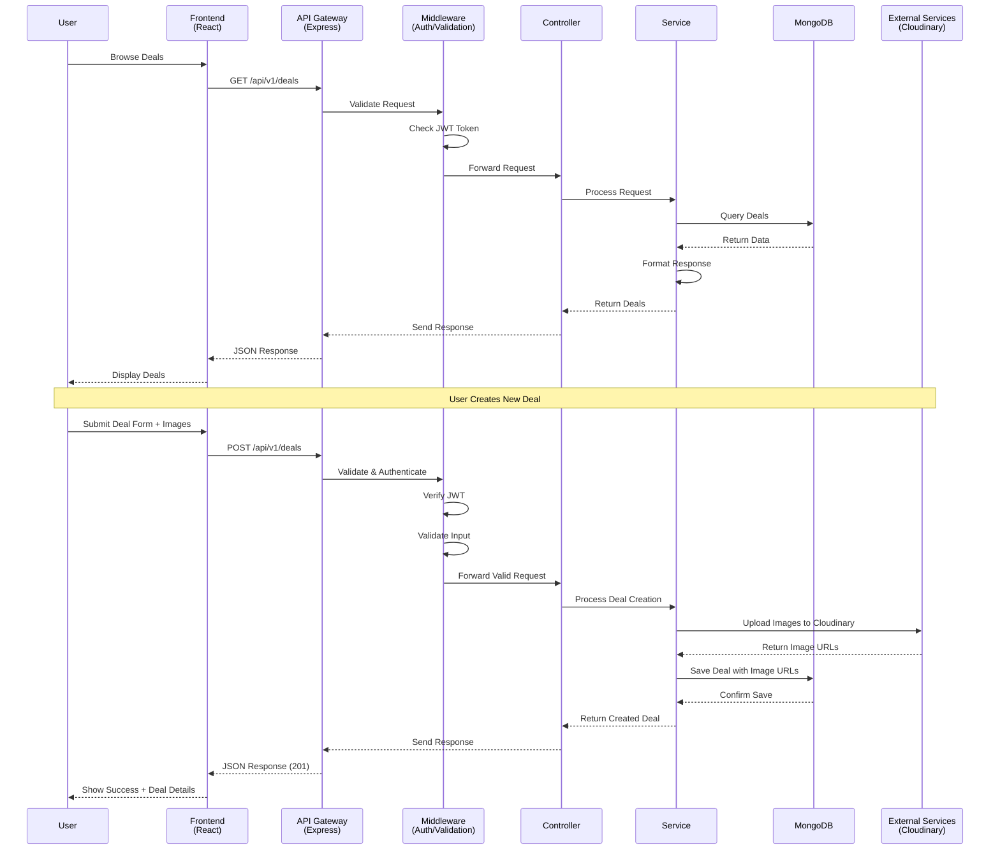
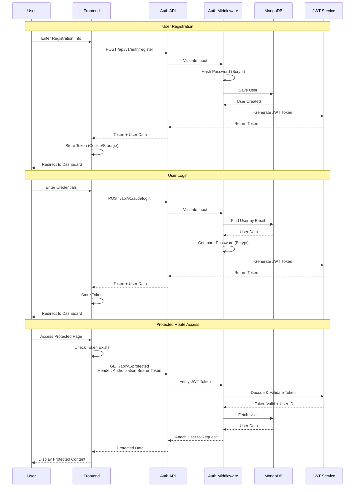
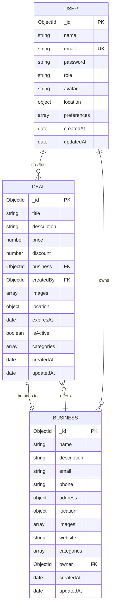
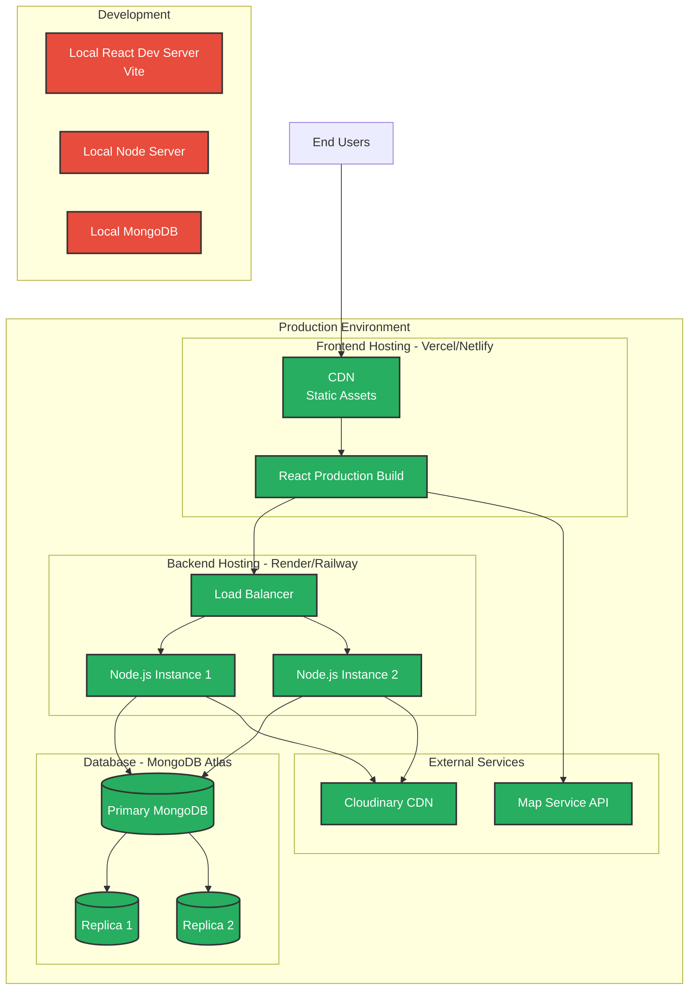

# SaveMate - System Architecture Diagram

## Complete System Architecture



## Data Flow Architecture



## Authentication Flow



## Database Schema Relationships



## Folder Structure

### Backend Structure
```
backend/
├── config/
│   ├── db.js                 # MongoDB connection
│   ├── auth.js               # JWT configuration
│   └── cloudinary.js         # Cloudinary setup
├── controllers/
│   ├── authController.js     # Authentication logic
│   ├── userController.js     # User CRUD operations
│   ├── dealController.js     # Deal CRUD operations
│   └── businessController.js # Business CRUD operations
├── middleware/
│   ├── auth.js               # JWT authentication
│   ├── error.js              # Error handling
│   ├── validation.js         # Input validation
│   ├── upload.js             # File upload (Multer)
│   └── rateLimiter.js        # Rate limiting
├── models/
│   ├── User.js               # User schema
│   ├── Deal.js               # Deal schema
│   └── Business.js           # Business schema
├── routes/
│   ├── authRoutes.js         # Auth endpoints
│   ├── userRoutes.js         # User endpoints
│   ├── dealRoutes.js         # Deal endpoints
│   └── businessRoutes.js     # Business endpoints
├── services/
│   ├── userService.js        # User business logic
│   ├── dealService.js        # Deal business logic
│   ├── businessService.js    # Business business logic
│   └── emailService.js       # Email functionality
├── utils/
│   ├── ApiError.js           # Custom error class
│   ├── ApiResponse.js        # Response formatter
│   ├── asyncHandler.js       # Async wrapper
│   └── validators.js         # Validation helpers
├── .env                       # Environment variables
├── .gitignore
├── package.json
└── server.js                  # Entry point
```

### Frontend Structure
```
frontend/
├── public/
│   ├── index.html
│   └── favicon.ico
├── src/
│   ├── components/
│   │   ├── common/
│   │   │   ├── Header.jsx
│   │   │   ├── Footer.jsx
│   │   │   ├── Loader.jsx
│   │   │   └── ErrorBoundary.jsx
│   │   ├── deals/
│   │   │   ├── DealCard.jsx
│   │   │   ├── DealList.jsx
│   │   │   ├── DealDetail.jsx
│   │   │   └── DealForm.jsx
│   │   ├── business/
│   │   │   ├── BusinessCard.jsx
│   │   │   ├── BusinessList.jsx
│   │   │   └── BusinessProfile.jsx
│   │   ├── auth/
│   │   │   ├── Login.jsx
│   │   │   ├── Register.jsx
│   │   │   └── PrivateRoute.jsx
│   │   └── map/
│   │       ├── MapView.jsx
│   │       └── LocationPicker.jsx
│   ├── pages/
│   │   ├── Home.jsx
│   │   ├── Deals.jsx
│   │   ├── DealDetails.jsx
│   │   ├── CreateDeal.jsx
│   │   ├── Profile.jsx
│   │   ├── Business.jsx
│   │   └── NotFound.jsx
│   ├── context/
│   │   ├── AuthContext.jsx
│   │   └── DealContext.jsx
│   ├── hooks/
│   │   ├── useAuth.js
│   │   ├── useDeals.js
│   │   └── useLocation.js
│   ├── services/
│   │   ├── api.js             # Axios configuration
│   │   ├── authService.js     # Auth API calls
│   │   ├── dealService.js     # Deal API calls
│   │   └── businessService.js # Business API calls
│   ├── utils/
│   │   ├── formatters.js      # Data formatting
│   │   ├── validators.js      # Form validation
│   │   └── constants.js       # App constants
│   ├── styles/
│   │   └── index.css          # Tailwind imports
│   ├── App.jsx
│   ├── index.js
│   └── routes.js
├── .env
├── .gitignore
├── package.json
├── tailwind.config.js
└── vite.config.js
```

## API Endpoints Structure

### Authentication Endpoints
```
POST   /api/v1/auth/register          # User registration
POST   /api/v1/auth/login             # User login
POST   /api/v1/auth/logout            # User logout
GET    /api/v1/auth/me                # Get current user
POST   /api/v1/auth/forgot-password   # Request password reset
PUT    /api/v1/auth/reset-password    # Reset password
```

### User Endpoints
```
GET    /api/v1/users                  # Get all users (admin)
GET    /api/v1/users/:id              # Get user by ID
PUT    /api/v1/users/:id              # Update user
DELETE /api/v1/users/:id              # Delete user
PUT    /api/v1/users/:id/avatar       # Update user avatar
```

### Deal Endpoints
```
GET    /api/v1/deals                  # Get all deals (with filters)
GET    /api/v1/deals/:id              # Get deal by ID
POST   /api/v1/deals                  # Create new deal (auth required)
PUT    /api/v1/deals/:id              # Update deal (auth required)
DELETE /api/v1/deals/:id              # Delete deal (auth required)
GET    /api/v1/deals/nearby           # Get deals near location
GET    /api/v1/deals/category/:cat    # Get deals by category
```

### Business Endpoints
```
GET    /api/v1/businesses             # Get all businesses
GET    /api/v1/businesses/:id         # Get business by ID
POST   /api/v1/businesses             # Create business (auth required)
PUT    /api/v1/businesses/:id         # Update business (auth required)
DELETE /api/v1/businesses/:id         # Delete business (auth required)
GET    /api/v1/businesses/:id/deals   # Get all deals for a business
```

## Deployment Architecture



## Technology Stack Summary

### Frontend Technologies
- **Framework**: React 18
- **Routing**: React Router v6
- **State Management**: Context API / Redux Toolkit
- **Styling**: Tailwind CSS
- **HTTP Client**: Axios
- **Maps**: React Leaflet or Google Maps API
- **Image Display**: Cloudinary
- **Form Handling**: React Hook Form
- **Date Handling**: date-fns
- **Build Tool**: Vite

### Backend Technologies
- **Runtime**: Node.js v18+
- **Framework**: Express.js
- **Database**: MongoDB (Mongoose ODM)
- **Authentication**: JWT (JSON Web Tokens)
- **Password Hashing**: Bcrypt
- **File Upload**: Multer
- **Image Storage**: Cloudinary
- **Validation**: Express Validator
- **Security**: Helmet.js, express-mongo-sanitize
- **Rate Limiting**: express-rate-limit
- **CORS**: cors middleware

### DevOps & Tools
- **Version Control**: Git & GitHub
- **API Testing**: Postman
- **Code Quality**: ESLint, Prettier
- **Testing**: Jest, React Testing Library
- **CI/CD**: GitHub Actions
- **Deployment**: Vercel (Frontend), Render/Railway (Backend)
- **Database Hosting**: MongoDB Atlas

---

## Notes for Implementation

1. **Environment Variables**: Always use .env files and never commit them to version control
2. **Security**: Implement rate limiting, input validation, and sanitization from the start
3. **Error Handling**: Use centralized error handling middleware
4. **Logging**: Implement proper logging for debugging and monitoring
5. **Testing**: Write tests as you develop, not after
6. **Documentation**: Keep API documentation updated using tools like Swagger
7. **Code Reviews**: Use pull requests and require reviews before merging
8. **Performance**: Optimize queries, implement caching where appropriate
9. **Scalability**: Design with growth in mind - use proper indexing, pagination
10. **Backup**: Regular database backups are essential
